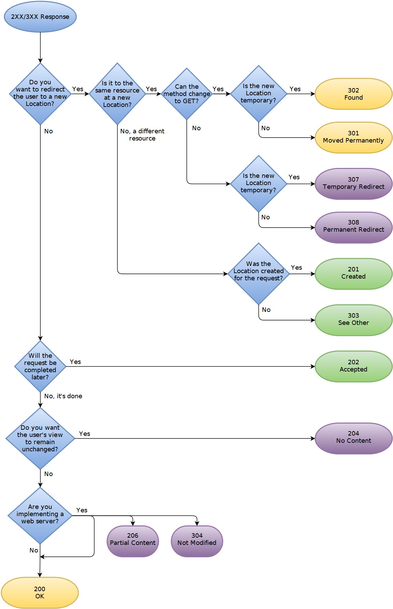

# Portfolio website
[](https://travis-ci.org/gyuhyeon/Portfolio) [](https://codeclimate.com/github/gyuhyeon/Portfolio/maintainability)  
This is a repository for my portfolio website.  
I'm thinking about making a tutorial that covers everything from basic static html to setting up aws, node.js, mysql, along with nginx to server as a front proxy.  
But for now, this is a consolidated project just to showcase my past works.

# How to use
If, for some reason you want to run this locally, you'll have to set up correct mysql(for past project showcases)/twilio(also for past project functionalities)/captcha configs in the format specified in the source code.  
You'll also have to make sure you have nodejs ^6.12.0.  
```
sudo npm install
node app.js
```

# Simple documentation for future reference

- [Node.js with Nginx](#Node.js-with-Nginx)
- [Node.js with HTTPS & Nginx](#Node.js-with-HTTPS-&-Nginx)
- [Note on HTTP codes...](#Note-on-HTTP-codes...)

## Node.js with Nginx
Node.js can act as a standalone web server, but it's more stable/robust if nginx is used as a proxy server and node.js receives requests through nginx.  
The structure is as follows:  
```
[Node.js app] <- HTTP(but port can be anything) -> [Nginx] <- HTTP(80)/HTTPS(443) -> [CLIENT]
```
- Install nginx
```
$ sudo apt-get update && sudo apt-get upgrade -y
$ sudo apt-get install nginx -y
```
- nginx checkup
```
$ sudo systemctl status nginx    # To check the status of nginx
$ sudo systemctl start nginx     # To start nginx
$ sudo systemctl enable nginx
```
- Configure nginx to act as a proxy
```
$ wget -q -O - 'http://169.254.169.254/latest/meta-data/local-ipv4'    # get private IP of the server (different from elastic public IP. Private IP is given to corporations.)
$ sudo rm /etc/nginx/sites-available/default    # we don't need preset configs
$ sudo vi /etc/nginx/sites-available/default    # make new one
server {
    listen 80;
    server_name your_domain.com;
    location / {
        proxy_pass http://private_ip_address:9000; # change 9000 to whatever port
        proxy_http_version 1.1;
        proxy_set_header Upgrade $http_upgrade;
        proxy_set_header Connection 'upgrade';
        proxy_set_header Host $host;
        proxy_cache_bypass $http_upgrade;
     }
}
```
- test nginx config
```
$ sudo nginx -t
$ sudo /etc/init.d/nginx reload   # reload if config was OK
```
- make node.js server listen to private IP at port specified in config above
```
app.listen(9000, 'private_ip_address');
```

## Node.js with HTTPS & Nginx
- Install certification with certbot(let's encrypt)
```
$ sudo apt-get update
$ sudo apt-get install software-properties-common
$ sudo add-apt-repository ppa:certbot/certbot
$ sudo apt-get update
$ sudo apt-get install python-certbot-nginx
$ sudo certbot --nginx       # optional : certonly option will only generate keys and not fiddle with options, but not recommended.
```
- set automated renewals
```
$ sudo certbot renew --dry-run   # check if it works
$ sudo crontab -e
sudo certbot renew --quiet
```
- check nginx config  
The file below will be automatically generated well if setting up HTTPS with Nginx was done AFTER configuring it well with HTTP and it was working(as guide above).  
If not, the proxy_pass and etc may need to be tweaked.  
```
# /etc/nginx/sites-available/default
server {
    listen 80;
    server_name gyuhyeonlee.com;
    location / {
        proxy_set_header X-Forwarded-Proto https; # important. this lets the node server know that it's actually secure.
        proxy_pass http://172.31.5.224:9000; # change 9000 to whatever port
        proxy_http_version 1.1;
        proxy_set_header Upgrade $http_upgrade;
        proxy_set_header Connection 'upgrade';
        proxy_set_header Host $host;
        proxy_cache_bypass $http_upgrade;
     }

    listen 443 ssl; # managed by Certbot
ssl_certificate /etc/letsencrypt/live/gyuhyeonlee.com/fullchain.pem; # managed by Certbot
ssl_certificate_key /etc/letsencrypt/live/gyuhyeonlee.com/privkey.pem; # managed by Certbot
    include /etc/letsencrypt/options-ssl-nginx.conf; # managed by Certbot
    ssl_dhparam /etc/letsencrypt/ssl-dhparams.pem; # managed by Certbot


    if ($scheme != "https") {
        return 301 https://$host$request_uri;
    } # managed by Certbot

}
```

[Reference article](https://medium.com/@utkarsh_verma/configure-nginx-as-a-web-server-and-reverse-proxy-for-nodejs-application-on-aws-ubuntu-16-04-server-872922e21d38)  
[Digital ocean reference](https://www.digitalocean.com/community/tutorials/how-to-set-up-a-node-js-application-for-production-on-ubuntu-16-04)  

## Note on HTTP codes...
I wasted a very long time trying to figure out why a POST request to http://domainuri was not going through the HTTPS/HTTP Nginx stack through Node.js.  
As it turns out, 301 Moved Permanently allows changing POST to GET when redirecting.  
In order to prevent that, we need 308.  
Anyway, the browser will be redirected to http right away when viewing the web page(GET). Therefore, any subsequent POST requests made through AJAX or whatever will be in https(because of relative link creation). It can remain as 301, just don't forget to use https explicitly when testing with POSTMAN or etc.  
Refer to the image below. Image credits go to [racksburg](http://racksburg.com/choosing-an-http-status-code/)  
  
